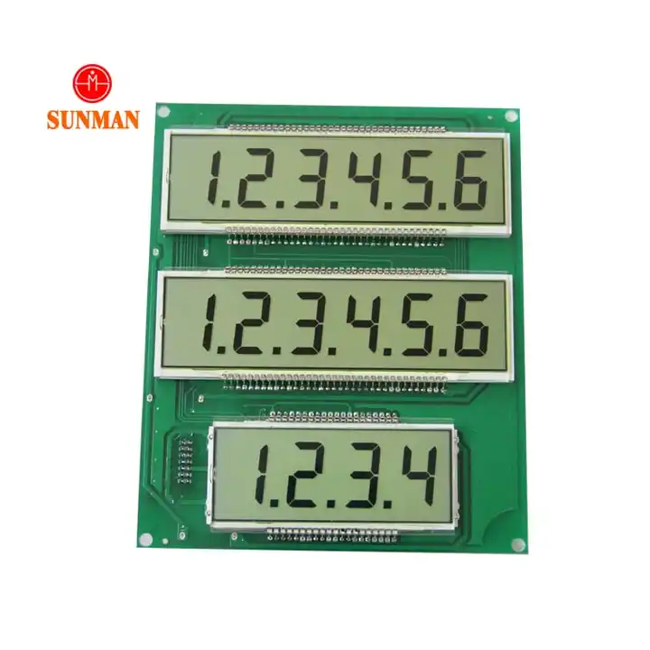

# LT-3XS664

This is a library for the LT-3XS664(595) display, which has three rows with six, six, and four slots, respectively.



## Usage

```c++
#include <Arduino.h>
#include <Display.h>

Display display(LCD_ENABLE_PIN, LCD_CLK_PIN, LCD_DATA_PIN);

void setup() {
  display.setup();

  display
    .updateRows("123456", "1.2.3.4.5.6." + "L.O.L. overflow...")
    .apply();
  delay(3000);
  display
    .updateRow(0, "timele")
    .updateRow(1, "s.words.")
    .clearRow(2)
    .apply();
  for (int i=0; i<3; ++i) {
    display
      .updateRow(2, (String)"in " + i)
      .apply();
    delay(1400);
  }
  display.cls(); // clear screen (just fills all slots with space)
  delay(500);
  display.updateRow(0, "as5", Align::Left).apply();  delay(400);
  display.updateRow(1,  "we", Align::Center).apply();   delay(400);
  display.updateRow(2, "can", Align::Right).apply();
}
```